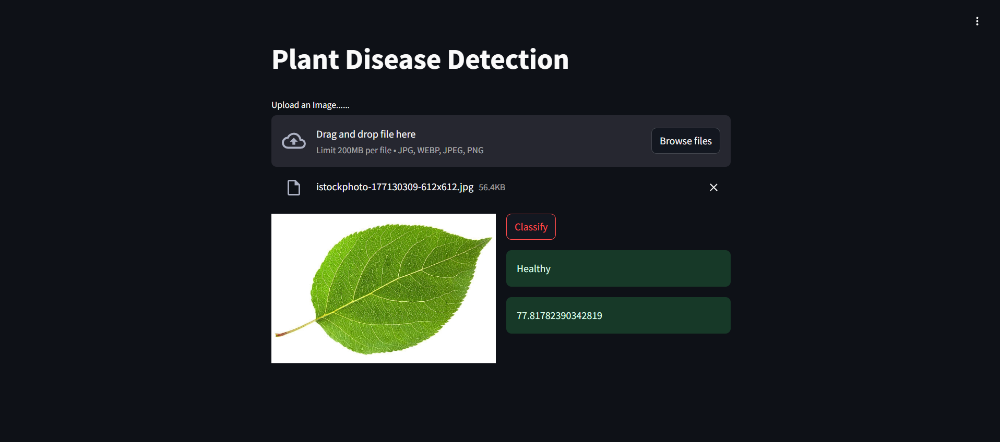

# 🌱 PlantPulse: Plant Disease Detection App 🌿

**PlantPulse** is an advanced plant disease Detection app designed to assist farmers and researchers in identifying plant diseases from images. By leveraging various Convolutional Neural Networks (CNN) and **transfer learning**, PlantPulse delivers highly accurate predictions for a wide range of plant diseases.

  

## 🚀 Features

- 🌾 **Plant Disease Detection**: Predict diseases from plant leaf images using advanced deep learning techniques.
- 🌟 **Transfer Learning**: Boosts performance by leveraging pre-trained models.
- 🔥 **Multiple CNN Models**: Includes ResNet, VGG, and custom CNN architectures.
- 💻 **Real-Time Predictions**: Provides fast, accurate disease detection directly from images.
- 📈 **High Accuracy**: Achieves state-of-the-art accuracy with the use of transfer learning.

## 🌿 Live Demo

Check out the live application [here](https://huggingface.co/spaces/YashGangan99/PlantPulse).

## 🧠 Tech Stack

PlantPulse is built using the following technologies:

- **Python**: Backend processing and model training.
- **TensorFlow & Keras**: Used for building and training CNN models.
- **Transfer Learning**: Pre-trained models like ResNet, VGG, and EfficientNet.
- **Streamlit**: For creating an interactive web interface.
- **OpenCV**: Image processing and pre-processing.

